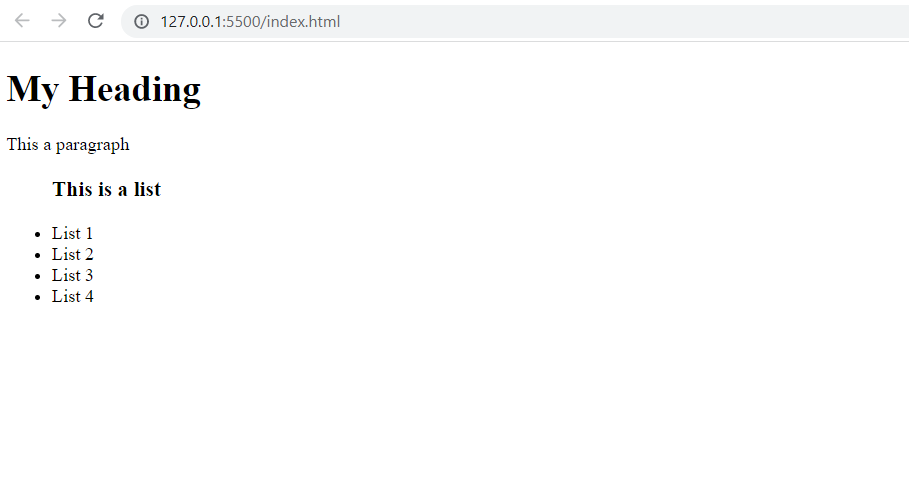

# HTML

## 1. Definition

- HTML stands for Hyper Text Markup Language
- HTML is the standard markup language for creating Web pages
- HTML describes the structure of a Web page
- HTML elements tell the browser how to display the content

## 2. What is an HTML element?

An HTML element is defined by a start tag, some content, and an end tag:

`<tagname>` Content goes here... `</tagname>`

The HTML element is everything from the start tag to the end tag:

`<h1>`My First Heading`</h1>`

`
`My first paragraph.`
`

| Start Tag | Description | End Tag |
| --- | --- | --- |
| `<h1>` | My First Heading | `</h1>` |
| `
` | My first paragraph | `
` |
| ` ` |	none | none |

Note: Some HTML elements have no content (like the   element). These elements are called empty elements. Empty elements do not have an end tag!

## 2. Web Browsers

The purpose of a web browser (Chrome, Edge, Firefox, Safari) is to read HTML documents and display them correctly.

A browser does not display the HTML tags, but uses them to determine how to display the document:

